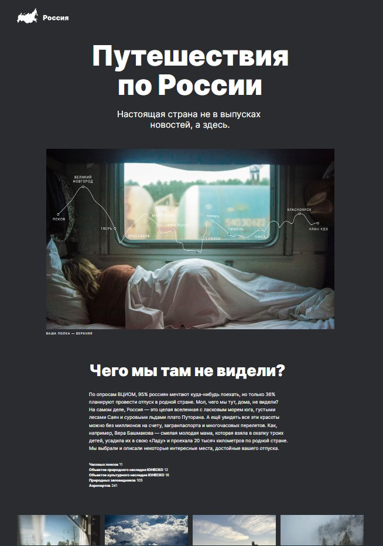

# Путешествие по России

Этот проект является учебным и главная цель его выполнения - закрепление навыков верстки.

## [Демонстрация сайта](https://8gato8.github.io/russian-travel/)

 

  

 

**Функционал:**

- Реализована адаптивная верстка. Макет меняет свое поведение в зависимости от разрешений: *1280px*, *1024px*, *768px* и *320px*
- Впервые использовал технология grid
- Впервые применены media queries
- Поработал с графическим редактором Figma

**Использованы следующие методы и технологии:**

- HTML
- CSS
- Flexbox layout
- [Методология BEM](https://ru.bem.info/methodology/ "Использована классическая схема организации файловой структуры БЭМ-проектов: Nested")
- Grid layout
- Media queries
- Figma

## Статус проекта и планы по доработке
Завершён. Доработки не планируются.
